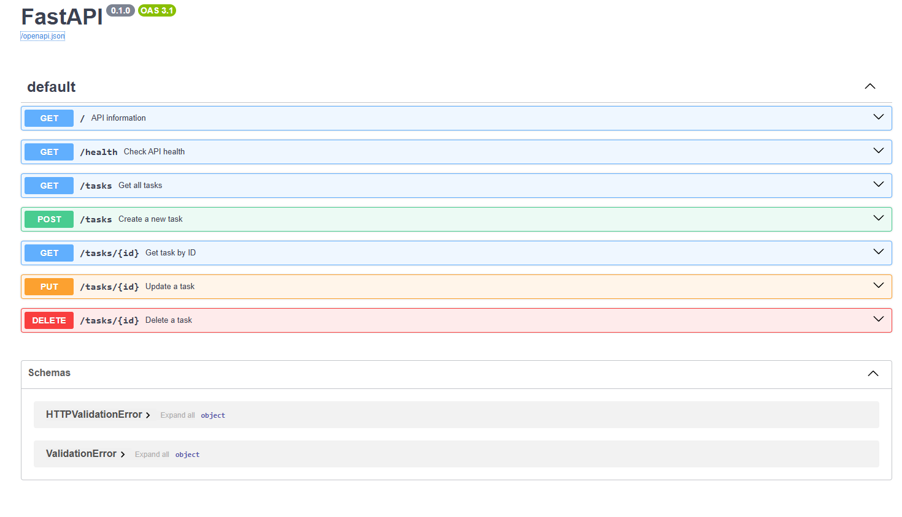

```text
 ______ _      ______            _       ___  _____
|  ___| |     | ___ \          | |     / _ \|_   _|
| |_  | |_   _| |_/ /__ _ _ __ | | __ / /_\ \ | |
|  _| | | | | |    // _` | '_ \| |/ / |  _  | | |
| |   | | |_| | |\ \ (_| | | | |   <  | | | |_| |_
\_|   |_|\__, \_| \_\__,_|_| |_|_|\_\ \_| |_/\___/
          __/ |
         |___/
```

# Task API

A simple CRUD REST API built with **FastAPI** for the FlyRank Backend Internship assignment.

---

## Features

- Create tasks
- Read all tasks
- Read a task by ID
- Update tasks
- Delete tasks
- Automatic Swagger UI documentation

---

## Tech Stack

- Python 3
- FastAPI
- Uvicorn

---

## Installation

Clone the repository:

```bash
git clone https://github.com/najtms/task-api.git
cd task-api
```

Install dependencies:

```bash
pip install fastapi uvicorn
```

Run the server:

```bash
uvicorn main:app --reload
```

The API will be available at:

```
http://localhost:8000
```

Swagger UI:

```
http://localhost:8000/docs
```

---

# API Endpoints

| Method | Endpoint | Description |
|---------|----------|-------------|
| GET | `/` | API information |
| GET | `/health` | Health check |
| GET | `/tasks` | Get all tasks |
| GET | `/tasks/{id}` | Get task by ID |
| POST | `/tasks` | Create task |
| PUT | `/tasks/{id}` | Update task |
| DELETE | `/tasks/{id}` | Delete task |

---

# Example curl Output

```bash
curl -i http://localhost:8000/tasks
```

Example response:

```http
HTTP/1.1 200 OK
content-type: application/json

[
  {
    "id":1,
    "title":"Task 0",
    "done":true
  },
  {
    "id":2,
    "title":"Task 1",
    "done":true
  }
]
```

---

# Swagger UI

Insert your screenshot here.

```markdown

```

---

# Project Structure

```
task-api/
│── main.py
│── README.md
└── images/
    └── Swagger.png
```

---

# Author

Muhamad Assaad <3

FlyRank Backend Internship Assignment